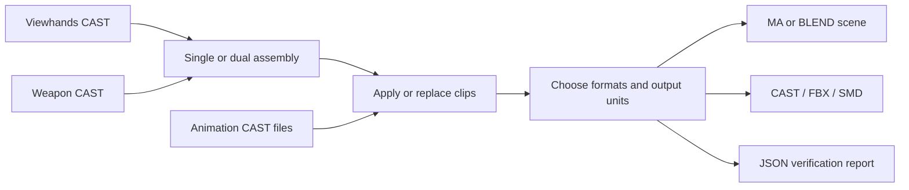

<div align="center">

# CoD Viewmodel Toolkit

**Assemble viewhands and weapons. Compose animations. Export from Maya or Blender.**

A local toolkit for Call of Duty first-person CAST models and skeletal animations.

[](https://github.com/ez4cywa/cod-viewmodel-toolkit/releases/latest)
[](https://github.com/ez4cywa/cod-viewmodel-toolkit/actions/workflows/static-checks.yml)
[](LICENSE)

[**Download**](https://github.com/ez4cywa/cod-viewmodel-toolkit/releases/latest) · [Maya guide](docs/MAYA.md) · [Blender guide](docs/BLENDER.md) · [Changelog](CHANGELOG.md) · [Report an issue](https://github.com/ez4cywa/cod-viewmodel-toolkit/issues/new/choose)

[**简体中文**](README.zh-CN.md) · English

</div>

## What you can do

| Task | Toolkit workflow |
| --- | --- |
| Attach a weapon to viewhands | Parent weapon `j_gun` to the hand rig's `tag_weapon` and zero the weapon's local translation without freezing joints. |
| Assemble dual wield | Duplicate one weapon for the left/right tags; play two clips simultaneously or sequentially. |
| Change one side's animation | Replace the left or right clip without rebuilding the assembly. |
| Correct an offset caused by a different rest pose | Supply compatible reference viewhands to compensate relative/additive weapon-tag translation tracks. |
| Export a set of animations | Queue single clips or explicit left/right pairs, choose formats and separate folders, and inspect per-item JSON reports. |
| Deliver meter-scaled assets | Optionally convert output copies from assumed feet to meters; keep the source files and working assembly unchanged. |

Maya includes a private, project-patched [CAST 2.01](https://github.com/dtzxporter/cast/releases/tag/v2.01) backend; Blender retains its project-patched CAST 2.00 backend and does not require Maya. Models, animations and textures are supplied by you; no game assets or host applications are bundled.



## Download and install

Current release: **3.5.0**. Maya now consistently uses its private CAST 2.01 backend, reuses animation parsing within an operation and routes animation through explicit DAG targets without temporary joint renaming. Includes the upstream skeleton-parent fix and a project curve-mode override fix. Blender behavior is unchanged. [Release notes](docs/RELEASE_NOTES_3.5.0.md).

| Host | English ZIP | 简体中文 ZIP | Runtime |
| --- | --- | --- | --- |
| Maya | [Download](https://github.com/ez4cywa/cod-viewmodel-toolkit/releases/download/3.5.0/cod-viewmodel-toolkit-3.5.0-maya-en.zip) | [下载](https://github.com/ez4cywa/cod-viewmodel-toolkit/releases/download/3.5.0/cod-viewmodel-toolkit-3.5.0-maya-zh-CN.zip) | Maya 2027 / Windows is the current verification host; Maya 2025 was verified in prior releases; targets Maya 2022+ in Python 3 mode. |
| Blender | [Download](https://github.com/ez4cywa/cod-viewmodel-toolkit/releases/download/3.5.0/cod-viewmodel-toolkit-3.5.0-blender-en.zip) | [下载](https://github.com/ez4cywa/cod-viewmodel-toolkit/releases/download/3.5.0/cod-viewmodel-toolkit-3.5.0-blender-zh-CN.zip) | Requires Blender 5.2+; Blender 5.2.1 LTS / Windows verified in prior releases. |

Download a **platform/language ZIP**, not GitHub's automatically generated “Source code” archive. [SHA-256 checksums](https://github.com/ez4cywa/cod-viewmodel-toolkit/releases/download/3.5.0/SHA256SUMS.txt) are included in the release. Python runs inside the selected host; no separate Python installation is needed for normal use.

### Maya

1. Save your work and close Maya before upgrading. Back up existing plugin files; keep your personal `cast.cfg` unchanged.
2. Extract the ZIP and copy **all files and folders** from `plug-ins` into a directory on `MAYA_PLUG_IN_PATH`. Keep `cod_viewmodel_units.py`, `cod_viewmodel_cast_backend.py` and the complete `cod_viewmodel_cast` folder beside the core file. Do not overwrite an independently installed `cast.py`, `castplugin.py` or `cast.cfg`.
3. Open Maya's Plug-in Manager. Load `viewmodel_weapon_toolkit.py` for English, or `viewmodel_weapon_toolkit_zh_CN.py` for Chinese. Enable only one language entry point.
4. Open **CoD Viewmodel Toolkit** / **CoD 视角模型工具包** in the main menu.

Upgrading from Attach Gun? The legacy `attach_gun.py` and `attachGun` command remain supported. See [installation and compatibility](docs/MAYA.md#installation) before switching entry points.

The toolkit registers its own `CoDToolkitCast` translator. An existing external CAST plugin may remain installed: its version and preferences no longer select the toolkit's backend. Load only the toolkit entry point, not the nested `cod_viewmodel_cast/castplugin.py`. Source checkouts can load their entry point directly without copying files from `third_party`.

### Blender

1. In **Edit → Preferences → Add-ons → Install from Disk**, select the Blender ZIP directly.
2. Enable **CoD Viewmodel Toolkit**, then press `N` in the 3D Viewport and open **Viewmodel**.
3. To switch languages, disable the old edition before installing the other; both use the same module name and do not change Blender's global language.

See the [Blender guide](docs/BLENDER.md) for assembly selection, scene behavior and Python API examples.

## Quick start

Prepare model-only viewhands and weapon CAST files, plus animation-only clips when needed. Texture files should remain available at their referenced paths.

| Goal | Maya | Blender |
| --- | --- | --- |
| First assembly | Open the single-weapon builder, choose viewhands and weapon, check inputs, select outputs and build. | Choose **Single Weapon**, fill the model paths, run **Check Inputs**, then **Build Assembly**. |
| Animate one weapon | Use **Import Animation Safely...**, or drop a pure-animation CAST into a valid toolkit assembly. | Select the toolkit armature and apply the selected clip. |
| Assemble dual wield | Open the dual builder; choose one weapon and left/right clips, then simultaneous or sequential playback. | Choose **Dual Wield**, supply both clips and select playback mode. |
| Replace a dual clip | Use **Replace Left Clip... / Replace Right Clip...** in the dual window. | Select the toolkit armature and use **Replace Left / Replace Right**. |
| Export multiple clips | Use **Single Animation Batch... / Dual Animation Batch...**. | Use **Animation Batch**, then **Start Batch Export**. |

Maya batch jobs start from isolated scenes; save the current scene when prompted. Blender builds a dedicated assembly collection and exports the selected assembly rather than unrelated scene objects. Blender's supported animation workflow uses the toolkit panel; Maya's safe external-drop behavior is not a shared cross-platform feature.

## Outputs and skinning

The table describes **animated export**. Maya's original builders default to a scene plus static CAST/FBX/SMD exports; use animation batch export for animated interchange files. Blender exports animation when the selected toolkit assembly has it.

| Format | Contents | DQS behavior |
| --- | --- | --- |
| MA / BLEND | Native scene or scoped assembly with skinning and animation | Preserves native DQS / Preserve Volume settings. |
| CAST | Assembled model and baked skeletal animation | Writes `quaternion` skinning metadata; the receiving importer must support it. |
| FBX | Skinned model and baked skeletal animation | Maya animation exports retain DQS. Blender FBX does not enforce it: enable **Dual Quaternion / Preserve Volume** in the receiving application. |
| SMD | Animated export: skeleton and animation only, no mesh | Does not encode DQS, bone scale or frame rate; configure the receiving application. |
| JSON | Inputs, verification, output paths, warnings and batch results | Inspection report, not a scene or animation format. |

Maya animation workflows explicitly set DQS; pure static Maya exports do not force that conversion. Existing files are not overwritten: Maya uses version suffixes such as `_v001`, Blender `_001`. Each enabled format can use its own folder.

**Units:** default **Keep original**. **Meters (input: ft)** assumes the source distance values are feet and applies `1 ft = 0.3048 m` to output copies. This is not automatic unit detection. Maya FBX may retain centimeter storage metadata while preserving the converted physical size. See [output units](docs/OUTPUT_UNITS.md) before applying another scale conversion.

## Skeletons and scope

- Single weapon: weapon `j_gun` attaches to viewhands `tag_weapon`. The **weapon root** is zeroed, not the hand rig's mount offset.
- Dual wield: viewhands need `tag_weapon_left/right`. The toolkit duplicates the **same weapon skeleton**; it does not merge two unrelated weapon rigs.
- Simultaneous mode uses the right clip for shared root/torso tracks. Sequential mode places the clips in consecutive ranges; paired clips must have matching frame rates.
- Reference-pose compensation requires compatible tag parents and affects relative/additive translation only; it is not general animation retargeting.
- Skeleton naming and source data determine compatibility. Support is not guaranteed for every Call of Duty title or extractor.
- Blender composes skeletal animation; blend-shape animation is skipped, and CAST IK/constraints/hair are disabled in this workflow. Textures remain external references.

Detailed behavior: [Maya guide](docs/MAYA.md) · [Blender guide](docs/BLENDER.md).

## Common questions

**Why is `tag_weapon` translation nonzero?** It positions the hand rig's mount relative to its parent. The attachment check concerns weapon `j_gun` under that tag, whose local XYZ translation should be zero. Do not zero the tag just to clear its displayed values.

**Maya rejects a dropped animation with `NameError: __file__`.** Update the complete plugin set to 3.4.1 or later and restart Maya. This registered-plugin path-resolution issue was fixed in 3.4.1. If another error appears, include its full Script Editor traceback in an issue.

**A dual scene fails through the ordinary single-weapon import menu.** Use the dual window's left/right replacement controls. The single-weapon attachment validator is not the dual-scene entry point.

**One weapon moves but floats away from the hand.** Check whether the animation was authored against a different viewhands rest pose. A compatible reference model can compensate tag translation; blindly zeroing bones cannot replace that check.

**The FBX deforms differently after importing.** Check DQS / Preserve Volume in the receiving app, especially for Blender FBX. For frame-by-frame comparisons in Blender, use animation offset `0`; also verify units and frame rate.

**Some animation tracks have no matching bone.** Extra tracks such as `j_gripsafety` can be skipped with a warning. A warning is not proof the entire import failed; inspect the remaining keys and the result report.

**What improved in 3.5.0?** GUI and batch operations share the same private backend and operation-local options. A tested single-animation drop now parses its CAST file once instead of four times. Animation targets use full DAG paths, with lookup caches discarded after each clip. This parse count is not a promise of a fixed speedup; see [measurements](docs/CAST_BACKEND_BENCHMARK.md). Attachment rules, output skinning and error dialogs are unchanged; successful attachment still has no completion dialog.

## Build and verify

For contributors; normal installation uses the ZIPs above. Run from the repository root:

```powershell
git clone https://github.com/ez4cywa/cod-viewmodel-toolkit.git
cd cod-viewmodel-toolkit
python tests/verify_vendored_cast.py
python tests/verify_vendored_blender_cast.py
mayapy tests/verify_plugin_identity.py
mayapy tests/verify_private_cast_backend.py
mayapy tests/verify_cast_v201.py
mayapy tests/verify_animation_read_session.py
mayapy tests/verify_maya_drop_module_path.py
python scripts/build_release.py ../release-output
```

`mayapy` is Maya's Python executable; use its full path if it is not on `PATH`. The build command produces **four** platform/language ZIPs and refuses to overwrite existing archives. Source installation details are in the [Maya](docs/MAYA.md#installation) and [Blender](docs/BLENDER.md#install) guides.

GitHub Actions runs syntax, bundled-backend integrity and generated-asset checks. It does **not** run Maya or Blender. Host-dependent verification is documented separately: [3.5.0 backend measurements](docs/CAST_BACKEND_BENCHMARK.md), [3.4.1 import fix](docs/VERIFICATION_3.4.1.md), [metric outputs](docs/VERIFICATION_3.4.0.md), [Maya/Blender](docs/VERIFICATION_3.3.0.md), [animation batches](docs/BATCH_ANIMATION_VERIFICATION.md). Maya 2022 compatibility is based on Python 3.7 syntax/API assessment, not a full host regression run.

## Project layout

```text
plug-ins/                         Maya core, language entry points and units
blender/cod_viewmodel_toolkit/     Blender assembly, animation, export and UI
third_party/                      Pinned CAST backends, licenses and patches
scripts/                          Release packaging and Blender localization
tests/                            Host checks and synthetic fixture regressions
docs/                             Platform guides and verification records
```

## Contributing and license

Report bugs through [Issues](https://github.com/ez4cywa/cod-viewmodel-toolkit/issues/new/choose) or submit a pull request. Include the toolkit version, host version, workflow, full error and expected result. Prefer synthetic or shareable reproduction files; the public repository does not distribute game assets. See [CONTRIBUTING.md](CONTRIBUTING.md) and [SECURITY.md](SECURITY.md).

The toolkit uses the [MIT License](LICENSE). Thanks to [dtzxporter/cast](https://github.com/dtzxporter/cast) for the upstream format and translators. Bundled backends contain project-specific patches and are not unmodified upstream releases: [Maya patches](third_party/cast/PATCHES.md), [Blender patches](third_party/cast_blender/PATCHES.md), [third-party notices](THIRD_PARTY_NOTICES.md).
