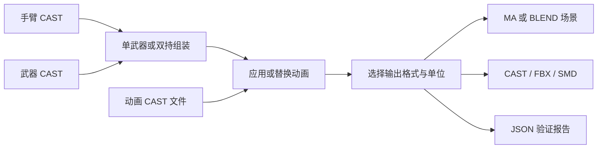

<div align="center">

# CoD Viewmodel Toolkit

**组装手臂与武器，合成动画，在 Maya 或 Blender 中批量导出。**

面向使命召唤第一人称 CAST 模型与骨骼动画的本地工具包。

[](https://github.com/ez4cywa/cod-viewmodel-toolkit/releases/latest)
[](https://github.com/ez4cywa/cod-viewmodel-toolkit/actions/workflows/static-checks.yml)
[](LICENSE)

[**下载安装包**](https://github.com/ez4cywa/cod-viewmodel-toolkit/releases/latest) · [Maya 使用说明](docs/MAYA.zh-CN.md) · [Blender 使用说明](docs/BLENDER.zh-CN.md) · [更新记录](CHANGELOG.md) · [反馈问题](https://github.com/ez4cywa/cod-viewmodel-toolkit/issues/new/choose)

简体中文 · [**English**](README.md)

</div>

## 可以做什么

| 场景 | 功能 |
| --- | --- |
| 将武器装到手臂上 | 将武器 `j_gun` 挂到手臂 `tag_weapon` 下，归零武器局部平移，不冻结关节。 |
| 组装双持武器 | 同一武器复制两份，分别挂接左右挂点，支持同时或顺序播放两段动画。 |
| 只换一侧动画 | 在已有双持组装中替换左侧或右侧片段，无需重建模型。 |
| 处理静止姿态不同造成的偏移 | 指定兼容参考手臂，补偿武器挂点的相对／叠加位移动画。 |
| 一次导出多个动画 | 单片段或左右配对加入队列，独立选择格式与目录，生成逐项 JSON 报告。 |
| 输出米制资产 | 可按输入为英尺换算输出副本，保留源文件和当前工作组装。 |

两个平台分别内置项目补丁版 [CAST 2.00](https://github.com/dtzxporter/cast/releases/tag/v2.00) 后端，Blender 版不依赖 Maya。模型、动画和贴图由用户提供，安装包不包含游戏资产或宿主软件。



## 下载与安装

当前版本 **3.4.2**：批量写入蒙皮权重，加快 Maya 挂载；取消挂载成功弹窗，保留错误提示。Blender 功能不变。详见[更新说明](docs/RELEASE_NOTES_3.4.2.md)。

| 平台 | 简体中文 ZIP | English ZIP | 运行环境 |
| --- | --- | --- | --- |
| Maya | [下载](https://github.com/ez4cywa/cod-viewmodel-toolkit/releases/download/3.4.2/cod-viewmodel-toolkit-3.4.2-maya-zh-CN.zip) | [Download](https://github.com/ez4cywa/cod-viewmodel-toolkit/releases/download/3.4.2/cod-viewmodel-toolkit-3.4.2-maya-en.zip) | 3.4.2 已验证 Windows Maya 2027；旧版已验证 Maya 2025；目标支持 Maya 2022+ 的 Python 3 模式。 |
| Blender | [下载](https://github.com/ez4cywa/cod-viewmodel-toolkit/releases/download/3.4.2/cod-viewmodel-toolkit-3.4.2-blender-zh-CN.zip) | [Download](https://github.com/ez4cywa/cod-viewmodel-toolkit/releases/download/3.4.2/cod-viewmodel-toolkit-3.4.2-blender-en.zip) | 要求 Blender 5.2+；已验证 Windows Blender 5.2.1 LTS。 |

请选择对应**平台和语言的 ZIP**，不要将 GitHub 自动生成的“Source code”源码包当作安装包。Release 同时提供 [SHA-256 校验文件](https://github.com/ez4cywa/cod-viewmodel-toolkit/releases/download/3.4.2/SHA256SUMS.txt)。正常使用由宿主自带 Python 运行，无需另装 Python。

### Maya

1. 升级前保存工作并关闭 Maya。备份原插件文件，保留个人 `cast.cfg`，不要覆盖。
2. 解压 ZIP，把 `plug-ins` 中的**全部文件**复制到 `MAYA_PLUG_IN_PATH` 包含的目录。`cod_viewmodel_units.py`、`cast.py`、`castplugin.py` 必须与核心文件放在一起。
3. 打开 Maya 插件管理器。中文版加载 `viewmodel_weapon_toolkit_zh_CN.py`，英文版加载 `viewmodel_weapon_toolkit.py`；只启用一个语言入口。
4. 从主菜单打开 **CoD 视角模型工具包**／**CoD Viewmodel Toolkit**。

从 Attach Gun 升级时，旧 `attach_gun.py` 入口和 `attachGun` 命令仍兼容；切换入口前请看[安装与兼容说明](docs/MAYA.zh-CN.md#安装)。

### Blender

1. 在 **Edit → Preferences → Add-ons → Install from Disk** 中直接选择 Blender ZIP。
2. 启用 **CoD Viewmodel Toolkit**，在 3D 视图按 `N`，打开 **Viewmodel** 标签。
3. 切换中英文版前先禁用旧版，再安装另一语言包。两者使用同一模块名，不修改 Blender 全局语言。

组装选择、场景行为和 Python 接口详见 [Blender 使用说明](docs/BLENDER.zh-CN.md)。

## 快速上手

准备只含模型的手臂、武器 CAST；需要动画时，再准备只含动画的 CAST。贴图文件应保留在引用路径中。

| 目标 | Maya | Blender |
| --- | --- | --- |
| 第一次组装 | 打开单武器构建器，选择手臂和武器，检查输入，选择输出并组装。 | 选择 **Single Weapon**，填写模型路径，执行 **Check Inputs** 和 **Build Assembly**。 |
| 导入单武器动画 | 使用 **Import Animation Safely...**，或向有效工具包组装中拖入纯动画 CAST。 | 选中工具包骨架，在面板中应用所选片段。 |
| 组装双持 | 打开双持构建器，选择一份武器及左右动画，设定同时或顺序模式。 | 选择 **Dual Wield**，填写左右动画并选择播放模式。 |
| 替换双持片段 | 在双持窗口使用 **Replace Left Clip... / Replace Right Clip...**。 | 选中工具包骨架，使用 **Replace Left / Replace Right**。 |
| 批量导出 | 使用 **Single Animation Batch... / Dual Animation Batch...**。 | 在 **Animation Batch** 中使用 **Start Batch Export**。 |

表内保留英文控件名，中文版对应“检查输入”“组装模型”“替换左／右动画”等操作。Maya 批量任务从独立场景开始，提示保存时先保存当前工作。Blender 创建专用组装集合，只导出所选组装，不带出无关对象。Blender 动画通过工具包面板导入，不能把 Maya 的外部文件安全拖放能力视为两端共有功能。

## 输出格式与蒙皮

下表针对**带动画导出**。Maya 原有构建器默认保存场景并输出静态 CAST／FBX／SMD；需要带动画的交换文件时，请使用动画批量导出。Blender 则根据选中组装是否有动画决定导出内容。

| 格式 | 内容 | DQS 保留情况 |
| --- | --- | --- |
| MA／BLEND | 带蒙皮、动画的原生场景或独立组装 | 保留原生 DQS／Preserve Volume 设置。 |
| CAST | 合并模型与烘焙后的骨骼动画 | 写入 `quaternion` 蒙皮标记，接收端导入器需支持。 |
| FBX | 蒙皮模型与烘焙动画 | Maya 动画导出保留 DQS；Blender FBX 不强制接收端使用 DQS，需在目标软件开启 **Dual Quaternion／Preserve Volume**。 |
| SMD | 带动画时只输出骨架与动画，不含网格 | 不保存 DQS、骨骼缩放或帧率，由接收软件配置。 |
| JSON | 输入、验证结果、输出路径、警告和批次结果 | 验证报告，不是模型或动画格式。 |

Maya 动画流程明确设置 DQS，纯静态 Maya 导出不强制转换。已有输出不会覆盖：Maya 自动使用 `_v001` 等版本后缀，Blender 使用 `_001`；每种启用格式可指定独立目录。

**单位：**默认“保持原单位”。选择“米（输入：英尺）”时，以 `1 ft = 0.3048 m` 换算输出副本，不会自动识别任意 CAST 的单位。Maya FBX 的存储元数据可能仍标为厘米，但实际换算尺寸正确；再次缩放前请看[输出单位说明](docs/OUTPUT_UNITS.md)。

## 骨骼约定与功能范围

- 单武器：武器 `j_gun` 挂到手臂 `tag_weapon` 下。归零的是**武器根骨骼**，不是手臂挂点本身的偏移。
- 双持：手臂需要 `tag_weapon_left/right`。工具复制**同一武器骨架**，不合并两套无关的武器骨架。
- 同时模式中，共享躯干／根骨轨道采用右侧片段；顺序模式将片段放到连续区间。左右片段帧率必须一致。
- 参考姿态补偿需要兼容的挂点父骨骼，只处理相对／叠加位移，不是通用动画重定向。
- 兼容性取决于骨骼命名和源数据，不保证支持所有使命召唤作品或提取器。
- Blender 流程合成骨骼动画，跳过形态键动画；CAST IK、约束与毛发在该流程中关闭，贴图仍为外部引用。

完整规则见 [Maya 使用说明](docs/MAYA.zh-CN.md)和 [Blender 使用说明](docs/BLENDER.zh-CN.md)。

## 常见问题

**为什么 `tag_weapon` 平移不为零？** 它定义手臂挂点相对父骨骼的位置。应检查其下武器 `j_gun` 的局部 XYZ 是否为零，不应只为清空数值而归零挂点。

**Maya 拖入动画报 `NameError: __file__`。** 更新完整插件文件到 3.4.1 或更高版本后重启 Maya。3.4.1 已修复注册插件环境下的路径定位错误；其他报错请提供脚本编辑器中的完整堆栈。

**双持场景通过普通单武器导入菜单报错。** 请使用双持窗口的左／右动画替换入口。普通单武器入口的挂接检查不等同于双持入口。

**武器能动，但一直偏离一只手。** 检查动画是否基于另一套手臂静止姿态制作。兼容参考模型可以补偿挂点位移，直接归零骨骼不能替代这项检查。

**FBX 导入后变形不同。** 先检查接收软件中的 DQS／Preserve Volume，尤其是 Blender 导出的 FBX。在 Blender 逐帧对比时将动画偏移设为 `0`，并核对单位和帧率。

**提示部分动画轨道找不到骨骼。** `j_gripsafety` 等额外轨道可能被跳过并产生警告。不代表整段动画导入失败，应结合其余关键帧和结果报告判断。

## 构建与验证

以下面向开发者，普通安装使用上方 ZIP。在仓库根目录运行：

```powershell
git clone https://github.com/ez4cywa/cod-viewmodel-toolkit.git
cd cod-viewmodel-toolkit
python tests/verify_vendored_cast.py
python tests/verify_vendored_blender_cast.py
mayapy tests/verify_plugin_identity.py
mayapy tests/verify_maya_drop_module_path.py
python scripts/build_release.py ../release-output
```

`mayapy` 是 Maya 自带的 Python，可用完整路径调用。构建命令生成**四个**平台／语言 ZIP，不覆盖已有压缩包。源码安装方法见 [Maya](docs/MAYA.zh-CN.md#安装)和 [Blender](docs/BLENDER.zh-CN.md) 使用说明。

GitHub Actions 只运行语法、内置后端完整性及生成资产检查，**不运行 Maya 或 Blender**。宿主验证单独记录：[3.4.1 导入修复](docs/VERIFICATION_3.4.1.md)、[米制输出](docs/VERIFICATION_3.4.0.md)、[Maya／Blender](docs/VERIFICATION_3.3.0.md)、[动画批量导出](docs/BATCH_ANIMATION_VERIFICATION.md)。Maya 2022 的兼容性来自 Python 3.7 语法与 API 检查，不代表已在该版本执行完整回归。

## 项目结构

```text
plug-ins/                         Maya 核心、语言入口与单位处理
blender/cod_viewmodel_toolkit/     Blender 组装、动画、导出与界面
third_party/                      固定版本 CAST 后端、许可证与补丁
scripts/                          发布打包与 Blender 中文本地化
tests/                            宿主检查与合成样本回归
docs/                             平台使用说明与验证记录
```

## 参与与许可证

欢迎提交 [Issue](https://github.com/ez4cywa/cod-viewmodel-toolkit/issues/new/choose) 或 Pull Request。反馈时请附工具版本、宿主版本、操作流程、完整报错与预期结果，优先使用合成或可公开分享的复现文件；公开仓库不分发游戏资产。开发规范见 [CONTRIBUTING.md](CONTRIBUTING.md)，安全问题见 [SECURITY.md](SECURITY.md)。

本工具包使用 [MIT License](LICENSE)。感谢 [dtzxporter/cast](https://github.com/dtzxporter/cast) 提供上游格式和转换器。内置后端包含项目补丁，并非未经修改的上游发行版：[Maya 补丁](third_party/cast/PATCHES.md)、[Blender 补丁](third_party/cast_blender/PATCHES.md)、[第三方声明](THIRD_PARTY_NOTICES.md)。
